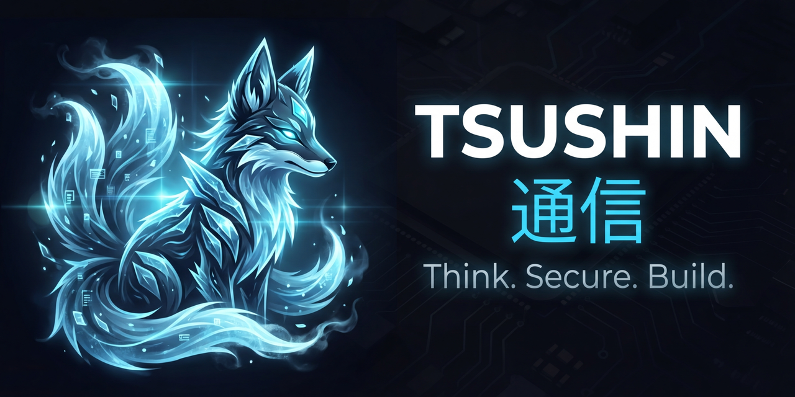

<p align="center">
  
</p>

<p align="center">
  <a href=""></a>
  <a href=""></a>
  <a href="https://opensource.org/licenses/MIT"></a>
</p>

**Tsushin** (通信 — "Communication" in Japanese) is a multi-tenant agentic messaging platform that unifies AI agent orchestration, conversational channels, semantic memory, workflow automation, AI-powered security, and observability — self-hostable, with RBAC and full multi-tenancy.

> 📖 **Full reference:** see **[docs/documentation.md](docs/documentation.md)** for the exhaustive technical guide covering every configuration item, feature, form field, channel, integration, API endpoint, and appendix.
>
> 📘 **User guide:** see **[docs/user-guide.md](docs/user-guide.md)** for a practical walkthrough of setting up channels, creating agents, configuring skills, building flows, using slash commands, and more.

---

## Feature Highlights

- **Multi-agent orchestration** — per-agent personas, tone presets, memory modes (isolated / channel / shared), keyword triggers, and dynamic agent switching.
- **Agent Teams** — line and mesh topologies, hidden internal coordinator, Studio Team Wizard + full Team Builder, Sentinel team-profile override, Watcher Team Runs observability with live WebSocket updates.
- **Continuous Agents** — wake on event/schedule, queue-driven runs, required Purpose + action_kind contract, and a Watcher run history that surfaces every wake event and outcome. Configure in **Studio → Continuous Agents**, monitor in **Watcher → Agents → Continuous Agents**.
- **Channels + triggers** — conversational channels cover WhatsApp (WAHA), Telegram, Slack, Discord, and Playground under Hub → Channels; event triggers cover Email, Webhook, Jira, and GitHub under Hub → Triggers; scheduled and recurring automation lives in Flows; Jira/GitHub/Password Vault credentials are managed under Hub → Tool APIs; auto-provisioned Whisper/Speaches/Kokoro/Ollama under Hub → Local Services.
- **10+ LLM providers** — OpenAI, Anthropic, Gemini, Groq, Grok, DeepSeek, Ollama, OpenRouter, Vertex AI, and any OpenAI-compatible endpoint. Provider instances are configured per-tenant via the Hub.
- **4-layer memory** — working, episodic, semantic (with temporal decay), and shared memory pool; optional OKG (Ontology Knowledge Graph) and experimental Trigger Case Memory v2.
- **Vector stores** — Chroma (built-in), Qdrant (auto-provisioned during setup when available), Pinecone, or MongoDB Atlas, with **multi-index per surface** (Agent KB, Project KB, long-term memory) and pluggable embedding providers.
- **22 built-in skills** — audio TTS/transcription, web search, image analysis + generation/editing, browser automation, Password Vault (1Password), Gmail (with granular send/reply/draft capabilities), Code Repository (GitHub), Ticket Management (Jira), flight search, scheduler, flows, automation, knowledge sharing, OKG terms, agent switcher, A2A agent communication, sandboxed shell/network tools, and more.
- **Custom skills** — Instruction, Script (Python/Bash/Node), and MCP-server skills, gated by a Sentinel scan at save-time.
- **37 slash commands** — agent management, email (Gmail), web search, shell, thread control, sandboxed tools, flows, scheduler, memory, project context, and system commands — all with per-contact access control.
- **Sandboxed tools** — per-tenant Docker containers with `nmap`, `nuclei`, `dig`, `httpx`, `whois`, `katana`, `subfinder`, `sqlmap`, and a generic webhook tool. Invoked via `/tool <name> <cmd> param=value`.
- **Flows** — 4 flow types (conversation, notification, workflow, task) with immediate, scheduled, recurring, keyword, or triggered execution. Triggered flows select an existing Hub trigger and get a locked Source step plus `flow_trigger_binding`; Source is not manually addable.
- **Sentinel security** — AI-powered detection across 9 threat types: prompt injection, agent takeover, poisoning, shell malicious intent, memory poisoning (MemGuard), agent privilege escalation, browser SSRF, vector-store poisoning, and continuous-agent action approval. Per-tenant, per-agent, and per-team profiles with block / warn-only / detect-only / off modes; dynamic threat-type derivation from `DETECTION_REGISTRY`.
- **Studio** — visual agent builder, personas, contacts, projects (knowledge isolation), custom skills, agent-to-agent communication, and Agent Teams.
- **Playground** — real-time streaming chat, audio recording + Whisper transcription, document-only uploads, command palette, memory inspector, expert mode. Plus **Playground Mini**, a floating quick-test bubble available on every authenticated page with markdown-rendered replies and a one-click expand-to-full-Playground handover that preserves the conversation.
- **Watcher** — observability dashboard with 7 top-level tabs (Dashboard · Graph View · Agents · Flows · Security · Channel Health · Billing); the **Agents** tab nests 5 agent-runtime sub-tabs (Continuous Agents · Wake Events · Conversations · Team Runs · A2A Comms).
- **Public API v1** — OAuth2 client credentials + direct API key, rate-limited, 40+ endpoints (agents, chat, flows, hub, studio, resources).
- **Multi-tenancy & RBAC** — 4 built-in roles (owner / admin / member / readonly), 47 permission scopes, per-tenant isolation, envelope-encrypted per-service keys.
- **Audit & compliance** — tenant-scoped audit events, CSV export, per-tenant retention, RFC 5424 syslog streaming (TCP / UDP / TLS).
- **Cloud-native** — Docker Compose (dev), Helm chart at `k8s/tsushin/` (GKE), GCP Secret Manager backend, Prometheus metrics at `/metrics`.

---

## v0.7.0 Highlights

v0.7.0 reshapes the Hub around four roles — **Channels** (conversational), **Triggers** (event sources), **Tool APIs** (programmatic credentials), and **Local Services** (auto-provisioned Whisper/Speaches/Kokoro/Ollama) — and adds Agent Teams, Continuous Agents, multi-index vector stores, and a self-hosted ASR engine. The v0.7.x sweeps further consolidate Watcher into 7 top-level tabs (with 5 agent-runtime sub-tabs nested under **Agents**) and introduce a Studio **Continuous Agents** tab plus a kind-chooser modal so the three creation surfaces (Agent / Continuous Agent / Team) are discoverable side-by-side. Configuration lives in Studio + Hub; observability lives in Watcher.

**Headline changes:**

- **Hub split — Channels vs Triggers vs Tool APIs vs Local Services** — Channels host WhatsApp/Telegram/Slack/Discord/Playground; Triggers host Email/Webhook/Jira/GitHub; Tool APIs host Jira/GitHub/Password Vault credentials; Local Services hosts auto-provisioned ASR/TTS/LLM containers. Standalone Schedule Trigger removed (cron lives only on FlowDefinition); Wake Events moved under Watcher.
- **Unified Trigger Creation Wizard + Visual Schedule Picker** — one wizard creates Email, Webhook, Jira, and GitHub triggers, selects or creates the required Hub integration, and hands off to the generated or wired flow at `/flows?edit=<auto_flow_id>` so operators configure outputs in the Flow editor.
- **Triggers ↔ Flows Unification (Waves 1-5)** — every new trigger now mints a system-managed FlowDefinition (Source → Gate → Conversation → Notification chain) in the same transaction. The Flow create path also supports **Triggered** by selecting an existing Email/Gmail, Jira, GitHub, or Webhook Hub trigger, then auto-generating a locked Source step and `flow_trigger_binding`. Source is a trigger-owned entry step, not a manual step type. The dispatcher fans wake events out to bound flows alongside the legacy ContinuousAgent path. All gated by env vars (`TSN_FLOWS_TRIGGER_BINDING_ENABLED`, `TSN_FLOWS_AUTO_GENERATION_ENABLED`, `TSN_FLOWS_BACKFILL_SUPPRESS_LEGACY`) for safe staged rollout.
- **Agent Teams (Phases 1-10)** — line and mesh topologies, hidden internal coordinator, Studio **Team Wizard** (Custom/Template, Basics, Topology, Members, Tools, Triggers, Review, Create), full **Team Builder** with React Flow canvas + Sentinel team-profile override + run drilldown, **Watcher Team Runs** observability with live WebSocket updates, mesh coordinator decision log, member-run cards, and Sentinel decision visibility. Webhook/GitHub/Jira/Gmail trigger bindings; transactional A2A membership snapshot/restore; team-scoped scratch tools and run-scoped memory; team-archive and hard-delete.
- **Continuous Agents** — wake-mode selector in the Studio New Agent modal (`Conversational` vs `Continuous`), required Purpose + action_kind contract, queue-driven runs, structured 409 detail surfaces actionable delete prompts, Watcher run history with wake-event evidence. v0.7.x adds a dedicated **Studio → Continuous Agents** tab plus a 3-way kind-chooser ("Compare options") modal that explains Agent / Continuous Agent / Team side-by-side so first-time users can pick the right surface up front.
- **Multi-index vector stores + pluggable embedding providers** — Agent KB, Project KB, and long-term memory now select an index per surface; per-surface contracts let each subsystem pick its own embedding provider (default, Gemini external, etc.).
- **Self-hosted Whisper as 2nd ASR engine + Hub ASR card** — Whisper and Speaches now ship as auto-provisioned local containers under Hub → Local Services, configured via the Hub > Add Provider > Speech-to-Text wizard, deletable through a cascade-aware banner that warns when the instance is still attached to agents. `/settings/asr` retired in favor of per-agent assignment from the Skills tab.
- **Password Vault foundation + UI-first financial workflow migration** — Hub → Tool APIs supports a provider-neutral Password Vault integration with 1Password as the first provider; setup is UI-first through Hub pickers. Agents can attach the Password Vault skill, and Flows can resolve explicit vault references through visible Flow steps while persisting only redacted outputs. Migrated financial workflows are accepted only when they can be recreated and edited from scratch in the UI with primitive nodes for vault credentials, HTTP/browser automation, extraction/transform, storage/dedupe, gates, and notifications. JSON import/export may be added later for speed, but it is not an acceptance substitute for manual UI reconstruction. The legacy opaque `financial_utility_automation` step type was **removed in v0.7.x (2026-05-07)** along with its frontend templates, config panel, backend handler, and three site-specific runners — the 6 migrated `Finan | …` flows already use only generic primitives. Notification-state classifier (`new_boleto`, `barcode_changed`, `pending_no_barcode`, `paid`, …) with per-state templates and `in` / `not_in` Gate operators landed in the v0.7.x patch series.
- **Variable Reference panel everywhere** — every templated step-config field (skill prompt, conversation objective, agentic gate prompt, slash-command body, gate-fail notification, etc.) gets the live Variable Reference panel with previous-step outputs + per-trigger-kind deep payload paths (Jira `payload.issue.key`, GitHub `payload.pull_request.title`, etc.). Drag-and-drop chips into any field.
- **Code Repository skill (GitHub)** — 12-action capability-gated skill (read on by default, write off by default) with a reusable encrypted `GitHubIntegration` Hub row and `pull_request` trigger criteria envelope. Same contract as `ticket_management` (Jira) — same `WRITE` badges in the agent UI, same tool-spec gating so the LLM never even sees disabled actions.
- **Ticket Management skill (Jira) + final Jira trigger slice** — agents can search/read/act on tickets via the `ticket_operation` tool. Capability-gated; write actions (`update`, `add_comment`, `transition`) off by default and filtered out of the LLM's tool spec. The trigger slice runs live JQL polling on Jira Cloud's enhanced JQL search endpoint, once-per-issue dedupe, encrypted Hub → Tool APIs Jira credentials, and notification output configured through the generated Flow.
- **Granular Gmail send capability** — `gmail` skill split into `search` / `read_message` (default ON) and `send` / `reply` / `draft` (default OFF). Same capability-gating contract; surfaces a real masked bug where `SkillManager` was ignoring saved per-agent capability config.
- **Email trigger criteria parity + Trigger Case Memory v2 (default-off, experimental)** — saved Gmail queries are mirrored into `trigger_criteria`, operators can test sample messages and force a poll-now run, and output routing is configured through the generated Flow. Trigger Case Memory v2 adds a per-trigger recap with optional Gemini external embeddings, gated by tenant-scoped SaaS feature flags.
- **Provider Wizard + Managed Container Panel** — guided multi-step provider setup (Hub > Add Provider), unified local-service controls (start/stop/restart/logs/status), Service API Keys disclosure, an LLM Providers Catalog endpoint, and a cascade-aware delete contract.
- **Cloudflared sidecar opt-out** — Remote Access can now defer to an externally managed tunnel; the backend still owns config, audit, entitlement, and status. Closes the v0.6.0 pre-release-hardening item.
- **Release-finishing UX** — `ConfirmDialog` with type-the-name protection for destructive trigger / flow / webhook-secret-rotation actions; tenantless-admin Hub gating (zero `400 User has no tenant` console errors when global admins browse `/hub` without a tenant context); shared agent-vs-flow explainer; Continuous-Agent purpose/action_kind enforcement.
- **v0.7.x IA reshape (post-release)** — Watcher consolidated from 11 to 7 top-level tabs with a single **Agents** tab nesting 5 agent-runtime sub-tabs (Continuous Agents · Wake Events · Conversations · Team Runs · A2A Comms); Studio gains a **Continuous Agents** tab + 3-way kind-chooser; auto-flow editor surfaces the bound trigger's JQL/search-query/criteria with an "Edit in Hub" deep link, prepends an upstream-filter callout on the gate, hides outbound-message fields on the system-managed Default-agent step, adds a per-step "Sample data this step receives" preview that fetches the most-recent wake event payload, and replaces the "Suppress default agent" checkbox with a **Parallel fire ↔ Flow-only** pill toggle. UI rename of "Watcher Monitor" → "Continuous Agent" everywhere (backend model name unchanged). Plus two related bug fixes: flow-step `on_failure` / `on_success` / `retry_delay_seconds` now round-trip through the API (were dropped silently), and the auto-flow gate now writes the canonical `gate_mode` / `gate_conditions` / `gate_logic` keys the engine actually reads.

**Full change log:** [docs/changelog.md](docs/changelog.md) — 80+ detailed entries covering every wave, phase, fix, and migration shipped in this release plus the in-progress v0.7.x patch series.

---

## Quick Start

### Prerequisites
- **Docker & Docker Compose V2**
- **Python 3.8+** with **pip** (installer only)
- **Git**

> The Docker network `tsushin-network` must exist before `docker compose up`. The installer creates it automatically. Manual: `docker network create tsushin-network`.

### Installation

```bash
# 1. Clone
git clone https://github.com/iamveene/Tsushin.git
cd Tsushin

# 2. Run installer (interactive — prompts for ports, access type, SSL)
python3 install.py

# Unattended, self-signed HTTPS, auto-detected IP
python3 install.py --defaults

# Unattended with Let's Encrypt SSL
python3 install.py --defaults --domain app.example.com --email you@example.com

# Let's Encrypt staging (for testing, avoids production rate limits)
python3 install.py --defaults --domain app.example.com --email you@example.com --le-staging

# See all options
python3 install.py --help

# 3. Open the URL printed at the end and finish the /setup wizard:
#    create admin account + configure at least one AI provider API key.
```

The installer handles infrastructure only (containers, networking, SSL, `.env` secrets). Organization setup and LLM provider keys are configured per-tenant through the `/setup` wizard and Hub UI — not via environment variables — enabling multi-tenant isolation.

### UI-first financial automation setup

New users configure and edit financial automations from the product UI:

1. Go to Hub → Tool APIs → Password Vault and create/test the 1Password service-account connection.
2. Attach the Password Vault skill from an agent's Skills tab or during the guided Agent Wizard; the UI must select the 1Password connection and capability toggles, not leave an unlinked skill row.
3. Go to Flows and use **From Template** for the supported financial catalog, or build manually from visible primitives: vault credential, explicit HTTP/API calls or Browser Automation actions, extraction/transform, storage/dedupe, Gate, and Notification. Browser-based automations should be split into editable actions such as navigate, fill username, fill password/TOTP from Password Vault, click submit, wait for selectors/URLs, dismiss modals, handle CAPTCHA/manual-handoff boundaries, extract fields, and capture evidence. These controls must be understandable to an operator; they should not require editing raw JSON or programming-like node blobs.
4. Save, manually run the Flow, confirm the local state update, run it a second time to prove dedupe, and validate conditional notification behavior for both notify and skip paths.

Consigaz also requires an explicit Password Vault field named `basic_auth` for the API token bootstrap; it is resolved by a visible vault step and is not stored in the template JSON.

Financial workflows are built exclusively from generic primitives — Password Vault, Browser Automation, HTTP Request, Data Transform, Financial Record Store / Utility Bill Store, Gate, and Notification. The previous opaque `financial_utility_automation` step (which dispatched to hardcoded site-specific scrapers) has been removed in favour of UI-recreatable flows. If a source flow cannot be recreated from a redacted manifest by using only the Flow UI, the missing control is a product bug; do not bypass the gap with backend row inserts or JSON import.

Operator-private Finan flow templates and playbooks live under `.private/finan_profiles.json` and `.private/finan_playbooks/*.json` (gitignored). Override the locations with `TSN_FINAN_PROFILES_PATH` and `TSN_FINAN_PLAYBOOK_DIR`. A clone without those files boots cleanly with zero Finan templates registered.

The template wizard is intentionally simple by default: it asks for the vault reference, Flow name, agent, channel, and recipient first, while technical overrides such as browser session profile, unit key, asset label, and timezone stay behind **Advanced options**. Created financial templates must remain editable like normal Flows, including Browser Automation URL/action controls and the ability to add Skill, Summarization, or Notification steps.

For the Parallels Ubuntu VM workflow used in fresh-install audits, you can sync the repo from your Mac with `bash deploy-to-vm.sh`, then SSH to the VM and run `sudo python3 install.py` from `~/tsushin`.

The generated Caddy config and frontend proxy build now target stack-scoped upstreams such as `${TSN_STACK_NAME}-frontend` and `${TSN_STACK_NAME}-backend`. That keeps both HTTP and HTTPS browser traffic pinned to the intended stack even when multiple Tsushin instances share `tsushin-network`.

→ Full deployment options, GKE/Helm, GCP Secret Manager, and rebuild-safety rules: see [docs/documentation.md §4 Deployment & Operations](docs/documentation.md#4-deployment--operations).

### Verify

```bash
curl http://localhost:8081/api/health      # Liveness
curl http://localhost:8081/api/readiness   # Readiness (checks PostgreSQL)
docker compose ps                          # Container states
```

### Development QA

v0.7.0 adds a frontend visual baseline suite for release preparation:

```bash
npm --prefix frontend run test:visual
```

The committed baselines live under `frontend/tests/visual/`; private reports, traces, and temporary screenshots stay in `.private/qa/v0.7.0/`.

---

## Architecture

```
┌──────────────────────────────────────────────────────────────────────────────┐
│                           TSUSHIN PLATFORM                                   │
├──────────────────────────────────────────────────────────────────────────────┤
│                                                                              │
│  ┌──────────────┐     ┌──────────────────┐     ┌──────────────────────────┐  │
│  │ Frontend UI  │     │   Backend API    │     │      RBAC Layer          │  │
│  │  Next.js 16  │◄───►│ FastAPI + PG 16  │◄───►│  Auth / Tenants / Roles  │  │
│  └──────────────┘     └────────┬─────────┘     └──────────────────────────┘  │
│                                │                                             │
│         ┌──────────────────────┼──────────────────────────┐                  │
│         │                      │                          │                  │
│         ▼                      ▼                          ▼                  │
│  ┌──────────────┐     ┌───────────────┐     ┌─────────────────────┐         │
│  │     CORE     │     │      HUB      │     │       STUDIO        │         │
│  │ Agent Engine │     │ AI Providers  │     │ Agents   Personas   │         │
│  │ 20 Skills    │     │ Comm Channels │     │ Contacts Projects   │         │
│  │ Sentinel     │     │ Tool APIs     │     │ Tone Presets        │         │
│  └──────┬───────┘     └───────┬───────┘     └─────────────────────┘         │
│         │                     │                                              │
│         ▼                     ▼                                              │
│  ┌──────────────┐     ┌───────────────┐     ┌─────────────────────┐         │
│  │    FLOWS     │     │    MEMORY     │     │      WATCHER        │         │
│  │ 4 types      │     │ Working       │     │ Dashboard  Billing  │         │
│  │ 15+ step     │     │ Episodic      │     │ Agents     Security │         │
│  │ Source/Gate  │     │ Semantic      │     │ Flows   Graph View  │         │
│  │ Templates    │     │ Shared        │     │ Channel Health      │         │
│  └──────────────┘     └───────────────┘     └─────────────────────┘         │
│                                                                              │
│  ┌──────────────────────────────┐     ┌──────────────────────────────────┐   │
│  │      SANDBOXED TOOLS         │     │          CHANNELS                │   │
│  │ Per-tenant Docker isolation  │     │ WhatsApp │ Telegram │ Slack      │   │
│  │ 9 pre-installed tools        │     │ Discord  │ Webhook  │ Playground │   │
│  └──────────────────────────────┘     └──────────────────────────────────┘   │
│                                                                              │
└──────────────────────────────────────────────────────────────────────────────┘
```

→ Full container topology, data flow, and dynamically-managed MCP containers: see [docs/documentation.md §2 Architecture Overview](docs/documentation.md#2-architecture-overview).

---

## Documentation Map

| Topic | Section |
|-------|---------|
| Deployment (Compose / GKE / GCP SM) | [§4](docs/documentation.md#4-deployment--operations) |
| Environment variable reference | [§5](docs/documentation.md#5-system-configuration) + [Appendix A](docs/documentation.md#29-appendix-a-complete-environment-variable-reference) |
| Authentication, SSO, RBAC | [§6](docs/documentation.md#6-authentication--access) + [Appendix B](docs/documentation.md#30-appendix-b-permission-scopes) |
| Agents, personas, tone presets | [§7](docs/documentation.md#7-agents), [§8](docs/documentation.md#8-personas--tone-presets) |
| Skills (built-in + custom) & sandboxed tools | [§9](docs/documentation.md#9-skills) |
| Memory, knowledge, vector stores | [§10](docs/documentation.md#10-memory--knowledge), [§11](docs/documentation.md#11-vector-stores) |
| Sentinel security | [§12](docs/documentation.md#12-security--sentinel) |
| Flows & scheduler | [§13](docs/documentation.md#13-flows), [§14](docs/documentation.md#14-scheduler--triggers) |
| Channels and triggers (WhatsApp / Telegram / Slack / Discord / Playground; Email / Webhook / Jira / GitHub) | [§14](docs/documentation.md#14-scheduler--triggers), [§15](docs/documentation.md#15-channels) |
| Contacts, projects, playground | [§16](docs/documentation.md#16-contacts--channel-mapping), [§17](docs/documentation.md#17-projects-studio), [§18](docs/documentation.md#18-playground) |
| LLM providers & hub integrations | [§19](docs/documentation.md#19-llm-providers), [§20](docs/documentation.md#20-hub-integrations) |
| Settings UI (every subpage) & system admin | [§21](docs/documentation.md#21-settings--ui-taxonomy), [§22](docs/documentation.md#22-system-admin-global-admin-only) |
| Audit & syslog | [§23](docs/documentation.md#23-audit-logging--compliance) |
| Observability & metrics | [§24](docs/documentation.md#24-observability) |
| Public API v1 reference | [§25](docs/documentation.md#25-public-api-v1) |
| Slash commands (37 commands + usage examples) | [§26](docs/documentation.md#26-slash-commands-system-wide-catalog) |
| Troubleshooting | [§28](docs/documentation.md#28-troubleshooting) |

---

## Essential Configuration

Representative minimal `.env` for a manual deployment. The installer writes a fuller file and derives stack-aware values such as `TSN_STACK_NAME`, `TSN_CORS_ORIGINS`, and local `TSN_AUTH_RATE_LIMIT` automatically:

```env
# Security — required
JWT_SECRET_KEY=<generated>        # python3 -c "import secrets; print(secrets.token_urlsafe(32))"
TSN_MASTER_KEY=<generated>        # Fernet key wrapping per-service encryption keys

# Stack identity
TSN_STACK_NAME=tsushin

# PostgreSQL — required
# Compose derives DATABASE_URL from TSN_STACK_NAME/POSTGRES_PASSWORD; set explicitly for manual deployments
DATABASE_URL=postgresql+asyncpg://tsushin:<password>@tsushin-postgres:5432/tsushin
POSTGRES_PASSWORD=<generated>

# Docker-in-Docker — required for MCP/toolbox container mounts
HOST_BACKEND_DATA_PATH=/absolute/host/path/to/backend/data

# URLs
TSN_BACKEND_URL=http://localhost:8081
TSN_FRONTEND_URL=http://localhost:3030
TSN_CORS_ORIGINS=http://localhost:3030,http://127.0.0.1:3030
TSN_AUTH_RATE_LIMIT=30/minute     # recommended local/self-signed default

# Logging & metrics
TSN_LOG_LEVEL=INFO                # DEBUG | INFO | WARNING | ERROR
TSN_LOG_FORMAT=text               # text | json (structured)
TSN_METRICS_ENABLED=true
```

**LLM provider API keys are configured per-tenant through the Hub UI**, not in environment variables — this enables true multi-tenant isolation. See [docs/documentation.md §19 LLM Providers](docs/documentation.md#19-llm-providers).

**Operational notes for WhatsApp:**
- Prefer `docker compose build --no-cache backend` followed by `docker compose up -d backend` (and the equivalent frontend commands) instead of `docker compose down`. The external `tsushin-network` now survives `down`, but routine rebuilds should still avoid tearing down the compose services.
- Hub → Channels now exposes dedicated **QA Tester** controls for the current tester target and also lists runtime tester rows in the main WhatsApp table, so QA sessions stay visible without mixing them into normal agent operations.
- Graph View now distinguishes explicit WhatsApp bindings, resolved-default bindings, and ambiguous/unassigned states; if an agent has WhatsApp enabled but no wire, check for the `WhatsApp Unassigned` warning node instead of assuming the graph failed to load.

→ Complete env-var reference (80+ variables, all defaults, all subsystems): [Appendix A](docs/documentation.md#29-appendix-a-complete-environment-variable-reference).

---

## Contributing

Contributions are welcome. See [docs/contributing.md](docs/contributing.md) for branching strategy, code style, and PR guidelines. Pre-commit hooks protect against accidental secret commits:

```bash
./scripts/setup-hooks.sh
```

---

## License

Tsushin is open-source software licensed under the [MIT License](LICENSE).

## Author

**Marcos Vinicios Penha** — [@iamveene](https://github.com/iamveene) 🇧🇷

---

**Version 0.7.0** · [Docs Index](docs/README.md) · [Changelog](docs/changelog.md) · [Documentation](docs/documentation.md) · [User Guide](docs/user-guide.md)
